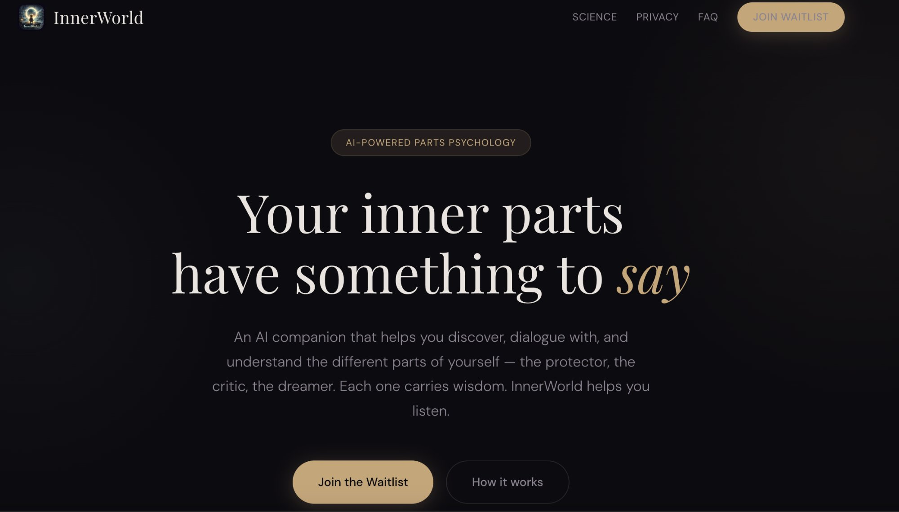

# 🔮 InnerWorld

**Your inner parts have something to say.**

InnerWorld is an AI system for self-understanding that models the mind as a set of internal “parts,” inspired by Internal Family Systems (IFS).

It helps users externalize internal conflicts, track patterns over time, and build a clearer understanding of their inner system.

[**→ Visit Landing Page**](https://stalisnguyen.github.io/innerworld) · [**→ Join the Waitlist**](https://tally.so/r/68v60Y)

---

## What is InnerWorld?

InnerWorld is an AI companion that helps you understand yourself through dialogue with your inner parts — the protector, the critic, the dreamer.

Instead of a single, continuous “self,” InnerWorld treats the mind as a system of interacting parts. Each part carries its own role, memory, and perspective.

Over time, InnerWorld builds longitudinal awareness — tracking how these parts evolve, interact, and influence your decisions.

---

## Core Idea

Most tools treat users as a single entity.

InnerWorld does not.

It models the mind as a **multi-entity system**, where internal parts can:
- hold distinct states and memories  
- persist over time  
- interact through structured dialogue  

This creates a **cognitive layer on top of standard AI interaction**, enabling deeper reflection than linear chat or journaling.

---

## How It Works

**1. Decompose**  
User input is semantically analyzed and mapped into distinct internal parts.

**2. Persist**  
Each part is stored as an entity with memory, state, and history.

**3. Interact**  
Users engage in structured, context-aware dialogue with and between parts.

**4. Evolve**  
Patterns emerge over time as parts shift, repeat, or resolve.

---

## Why It Matters

- Journaling is static  
- Chatbots are linear  
- Self-perception is fragmented  

InnerWorld makes internal structure visible — and interactive.

---

## Grounded in Science

InnerWorld is inspired by **Internal Family Systems (IFS)**, developed by Dr. Richard Schwartz.

The system is designed as a **facilitator, not a therapist**:
- no diagnosis  
- no prescription  
- no replacement for professional care  

It simply helps users **observe and interact with their inner system more clearly**.

---

## Privacy

Your inner world stays yours.

- 🔒 Encrypted in transit and at rest  
- 🚫 Never sold, never used for ads  
- 🤖 Never used for model training  
- 🗑️ Full control: export or delete anytime  

---

## Built For

- **Individuals** — seeking structured self-understanding  
- **Practitioners** — extending parts work beyond sessions  

---

## Status

🚧 Early stage — concept + PoC

Join the waitlist to get early access and help shape the system.

---

## Contact

Built by **Stalis Nguyen**  
[Join Waitlist](https://tally.so/r/68v60Y)

---

Built with intention · 2026

